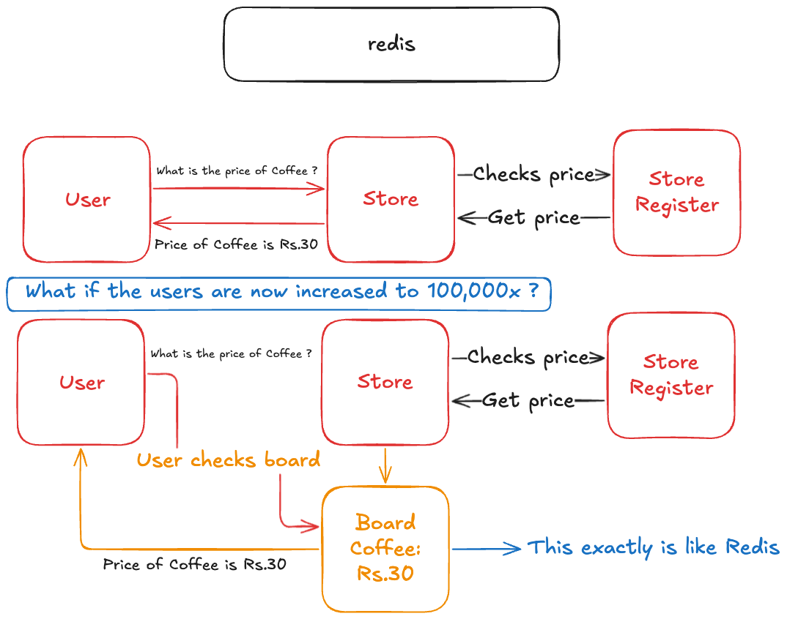
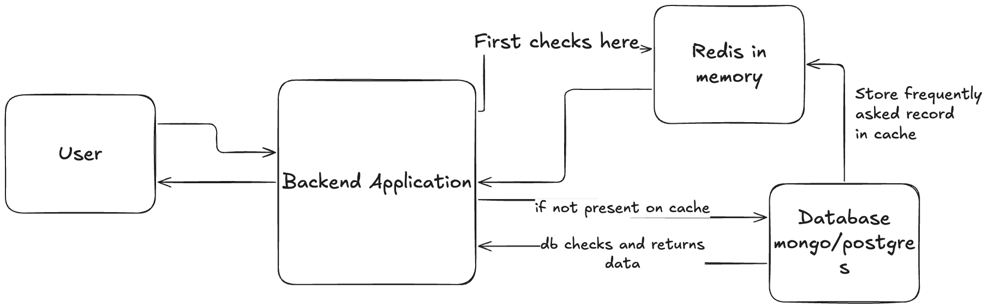
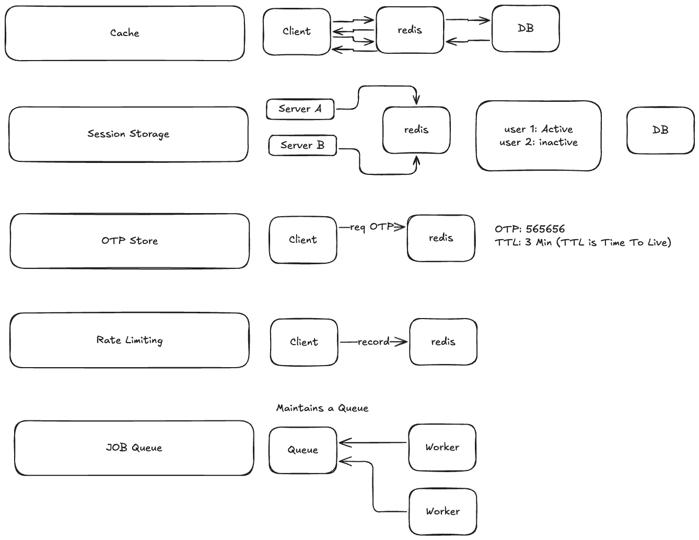

<!-- ![[What is Redis and Why it Exists ? 2026-05-23 11.35.16.excalidraw]] -->

## Redis is like a in-memory Data store. It is primarily used to reduce the read pressure on the main database. It addresses bottlenecks by serving as a caching layer. 
## It is crucial to remember that Redis is not a replacement for your database.  
## Redis stores the state in RAM and hence it is said to be FAST.

<!-- ![[What is Redis and Why it Exists ? 2026-05-23 11.43.57.excalidraw]] -->

## Use Cases of Redis:
<!-- ![[What is Redis and Why it Exists ? 2026-05-23 11.54.53.excalidraw]] -->

- **Caching:** Storing frequently accessed data to speed up response times.
- **Session Storage:** Managing user login states across multiple servers.
- **OTP/Temporary Data:** Storing short-lived information like OTPs that don't need permanent storage.
- **Rate Limiting:** Tracking and limiting the number of requests a user can make within a specific timeframe.
- **Job Queues:** Managing background tasks, such as email processing or bulk notifications, using lists.
## Core Mechanics:
It works on **Key-Value** pair structure. A critical Feature is **TTL(Time to Live)**, which allows developers to set an expiration on records so that they are automatically cleaned up, which is perfect for temporary data like OTPs.
## Guidelines for Implementation:
- Redis is **not a solution for every problem**. It should be utilized specifically when you need to remove read bottlenecks, store temporary/expiring data, use shared counters, or handle background job queues.
## Alternatives to Redis:
- Because Redis is so popular, many 'drop-in replacements' have emerged that offer similar functionality without requiring code changes. Notable mentions include **KeyDB**, **DragonflyDB**, and **Valkey**.