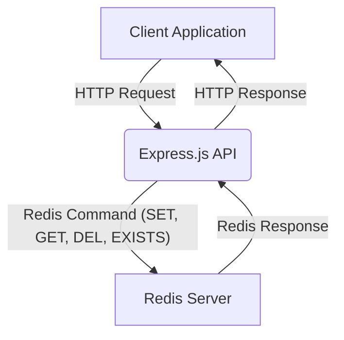
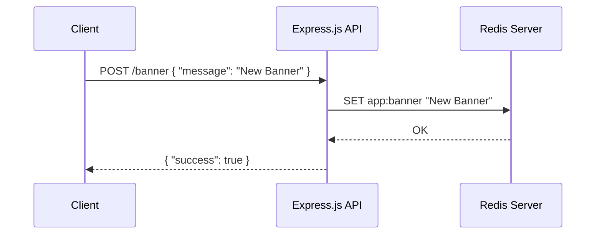
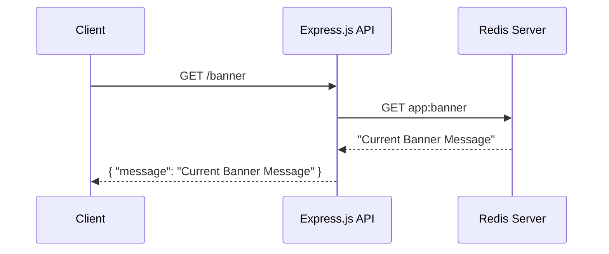

# Site Banner APIs with Redis

This project implements a simple set of APIs for managing a site banner using Express.js and Redis. Redis is utilized as a fast in-memory data store for quick retrieval and management of the banner message.

## What are Site Banner APIs?

Site banner APIs typically allow dynamic management of messages displayed prominently on a website or application (e.g., for announcements, alerts, or promotional messages). These messages often need to be updated frequently and retrieved very quickly by many users, making Redis an excellent choice for storage due to its performance characteristics.

## How Redis is Used

Redis acts as a central, high-performance key-value store for the site banner message.
-   **Key:** `app:banner` is used to store the single banner message.
-   **Operations:** Redis's `SET`, `GET`, `DEL`, and `EXISTS` commands are directly mapped to API endpoints for creating/updating, reading, deleting, and checking the presence of the banner, respectively.
This approach ensures low-latency access to the banner content, crucial for user-facing elements.

## API Endpoints

The application exposes the following RESTful API endpoints:

### `POST /banner`

*   **Description:** Creates or updates the site banner message.
*   **Method:** `POST`
*   **Body:** `application/json`
    ```json
    {
      "message": "Your new banner message here!"
    }
    ```
*   **Default Message:** If `message` is not provided in the request body, it defaults to "Welcome to Redis!!".
*   **Redis Operation:** `SET app:banner <message>`
*   **Example Response:**
    ```json
    {
      "success": true
    }
    ```

### `GET /banner`

*   **Description:** Retrieves the current site banner message.
*   **Method:** `GET`
*   **Redis Operation:** `GET app:banner`
*   **Example Response:**
    ```json
    {
      "message": "Your current banner message."
    }
    ```
    If no banner is set, `message` will be `null`.

### `DELETE /banner`

*   **Description:** Deletes the site banner message.
*   **Method:** `DELETE`
*   **Redis Operation:** `DEL app:banner`
*   **Example Response:**
    ```json
    {
      "success": true
    }
    ```

### `GET /banner/exist`

*   **Description:** Checks if a site banner message currently exists.
*   **Method:** `GET`
*   **Redis Operation:** `EXISTS app:banner`
*   **Example Response:**
    ```json
    {
      "exists": true
    }
    ```
    or
    ```json
    {
      "exists": false
    }
    ```

## Diagrams

### 1. Overall Architecture Flow


**Explanation:** The client (e.g., a web browser or another service) makes an HTTP request to the Express.js API. The API then interacts with the Redis server to perform the requested operation (setting, getting, deleting, or checking existence of the banner). Redis responds to the API, which in turn sends an HTTP response back to the client.

### 2. POST /banner Flow


**Explanation:** The client sends a `POST` request to `/banner` with a new message. The Express.js API instructs Redis to `SET` the `app:banner` key with this message. Redis confirms the operation, and the API sends a success response back to the client.

### 3. GET /banner Flow


**Explanation:** The client sends a `GET` request to `/banner`. The Express.js API queries Redis for the value associated with `app:banner`. Redis returns the stored message, which the API then sends back to the client.

## Getting Started

To run this application:

1.  **Ensure Redis is running:** You can use Docker or install it directly.
    *   If using Docker, ensure your `docker-compose.yml` includes a Redis service.
2.  **Install dependencies:**
    ```bash
    npm install
    ```
3.  **Set Redis URL (if not default):**
    Set the `REDIS_URL` environment variable if your Redis instance is not at `redis://localhost:6379/`.
4.  **Start the application:**
    ```bash
    npm start # Or node src/index.js
    ```
    The server will run on `http://localhost:3000`.
