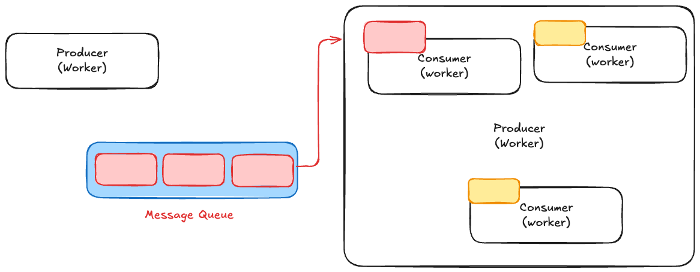

# BullMQ Queue Infrastructure

This project demonstrates a basic message queue infrastructure using BullMQ, a robust, Redis-backed queue for Node.js. It illustrates the producer-consumer pattern, where an API acts as a producer adding jobs to a queue, and a separate worker process consumes and processes these jobs.

## Architecture

The system follows a classic message queue pattern as depicted below:



*   **Producer (API)**: Adds jobs to the message queue. In this setup, an Express API endpoint serves as the producer for "welcome email" jobs.
*   **Message Queue (Redis + BullMQ)**: Acts as an intermediary, storing jobs reliably until they can be processed. BullMQ uses Redis to persist job data, ensuring durability and reliability.
*   **Consumers (Workers)**: Processes jobs from the message queue. A separate Node.js script runs a BullMQ worker that picks up and executes the "welcome email" jobs.

## Implementation Details

The project consists of three main parts:

### 1. `src/queue.js` - Queue Configuration

This file initializes the BullMQ queue and defines the connection to Redis.

*   **`emailQueue`**: A BullMQ `Queue` instance named `emails`. This is where all email-related jobs are added and processed.
*   **`connection`**: Defines the Redis connection parameters. By default, it connects to Redis running on `localhost:6379`.

```javascript
// src/queue.js
import { Queue } from 'bullmq'

const connection = {
  host: 'localhost',
  port: 6379
}

const emailQueue = new Queue('emails', { connection })

module.exports = {
  emailQueue,
  connection
}
```

### 2. `src/api.js` - Job Producer (API)

This Express application acts as the producer. It exposes an endpoint that, when hit, adds a new job to the `emailQueue`.

*   **Endpoint**: `POST /welcome-email`
    *   Accepts `to` and `name` in the request body.
    *   Adds a job named `send-welcome-email` to the `emailQueue`.
    *   **Job Configuration**:
        *   `attempts: 3`: The job will be retried up to 3 times if it fails.
        *   `backoff: { type: 'exponential', delay: 1000 }`: Retries will occur with an exponentially increasing delay, starting from 1 second.
*   **Server**: Listens on port `3000`.

```javascript
// src/api.js
import express from 'express'
import { emailQueue } from './queue.js'

const app = express()
app.use(express.json())

app.post('/welcome-email', async (req, res) => {
  const job = await emailQueue.add( // Changed to await to get job.id
    'send-welcome-email',
    {
      to: req.body.to,
      name: req.body.name || 'Learner'
    },
    {
      attempts: 3,
      backoff: {
        type: 'exponential',
        delay: 1000
      }
    }
  )
  res.json({
    message: 'Welcome email job added to queue',
    jobId: job.id
  })
})

app.listen(3000, () => {
  console.log('Server Running on 3000')
})
```

### 3. `src/worker.js` - Job Consumer (Worker)

This script runs the BullMQ worker that listens to the `emails` queue and processes the jobs.

*   **`Worker`**: Instantiated with the queue name `emails` and the Redis `connection`.
*   **Job Processing Logic**: The `async job => { ... }` function defines what happens when a job is received. In this example, it simulates an email sending process with a 1.5-second delay and logs the job details.
*   **Event Listeners**:
    *   `worker.on('completed', job => { ... })`: Logs a message when a job successfully completes.
    *   `worker.on('failed', job => { ... })`: Logs a message when a job fails.

```javascript
// src/worker.js
import { Worker } from 'bullmq'
import { connection } from './queue'

const worker = new Worker(
  'emails',
  async job => {
    console.log('Processing email Job...', job.id, job.name, job.data)
    await new Promise(resolve => setTimeout(resolve, 1500)) // Simulate async work
    console.log('Email Job Completed!!', job.id, job.name, job.data)
  },
  { connection }
)

worker.on('completed', job => {
  console.log('Job Completed!!', job.id, job.name, job.data)
})

worker.on('failed', job => {
  console.log('Job Failed!!', job.id, job.name, job.data)
})
```

## Setup and Running

To run this application, you need a running Redis instance and Node.js.

### Prerequisites

*   Node.js (v14 or higher)
*   Redis (v6 or higher)

### Steps

1.  **Install Dependencies:**
    Navigate to the `07-BullMQ-Queue-Infrastructure` directory and install the required packages:
    ```bash
    npm install
    ```

2.  **Start Redis Server:**
    Ensure your Redis server is running. If you have a `docker-compose.yml` file in the parent directory, you can start it using:
    ```bash
    docker-compose up -d redis
    ```
    (Adjust the service name if different)

3.  **Start the Worker Process:**
    Open a new terminal window, navigate to the project directory, and start the worker. This process will listen for and consume jobs from the queue.
    ```bash
    npm run worker
    ```
    You should see output like: `BullMQ Worker started.` (This is a placeholder log, the actual worker doesn't log "started" by default, but it will start processing.)

4.  **Start the API (Producer) Process:**
    Open another terminal window, navigate to the project directory, and start the API server. This server will allow you to add jobs to the queue.
    ```bash
    npm start
    ```
    You should see output like: `Server Running on 3000`

### Adding Jobs to the Queue (Using the API)

Once both the worker and API are running, you can add jobs using `curl`.

**Example:** Send a welcome email job.

```bash
curl -X POST -H "Content-Type: application/json" -d '{"to": "test@example.com", "name": "Gemini Learner"}' http://localhost:3000/welcome-email
```

Upon executing the `curl` command, you should see a response from the API indicating the job has been added. Simultaneously, in the terminal running `src/worker.js`, you will observe logs showing the job being processed and then completed.
