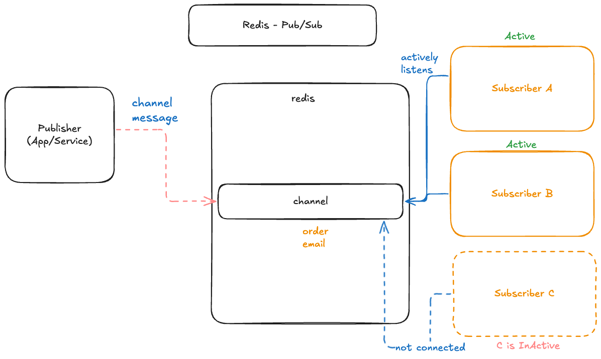

# Redis Pub/Sub (Publish/Subscribe) Example

This project demonstrates the Publish/Subscribe (Pub/Sub) messaging paradigm using Redis. It showcases how a publisher can send messages to a channel without knowing which subscribers are listening, and how multiple subscribers can receive messages published to that channel.

## Architecture

The Redis Pub/Sub model works as follows:



*   **Redis Pub/Sub**: The core messaging system. Redis acts as a message broker, managing channels and distributing messages to subscribers.
*   **Publisher (App/Service)**: An application or service that sends messages to a specific channel. In this example, `src/api.js` acts as the publisher. Publishers are decoupled from subscribers.
*   **Channel**: A named entity in Redis to which messages are sent by publishers and from which messages are received by subscribers. Subscribers express interest in one or more channels.
*   **Subscribers**: Applications or services that listen for messages on one or more channels. In this example, `src/subscriber.js` acts as a subscriber.
    *   **Active Subscribers (A, B)**: Actively connected to Redis and listening to the channel. They will receive all messages published to that channel.
    *   **Inactive Subscribers (C)**: Not currently connected. They will *not* receive messages published while they are disconnected. Redis Pub/Sub does not persist messages for disconnected clients.

## Implementation Details

The project consists of two main Node.js applications:

### 1. `src/api.js` - The Publisher

This Express application acts as the message publisher. It provides an HTTP endpoint to trigger message publishing to a Redis channel.

*   **Redis Connection**: Initializes an `ioredis` client (`publisher`) to connect to Redis. It uses `process.env.REDIS_URL` or defaults to `redis://localhost:6379`.
*   **Endpoint**: `POST /notifications`
    *   Expects an optional `title` in the request body.
    *   Constructs a payload including the title and a timestamp.
    *   **`publisher.publish('notifications', JSON.stringify(payload))`**: This is the core Pub/Sub command. It publishes the JSON stringified payload to the Redis channel named `notifications`.
    *   The API's response indicates how many subscribers received the message.
*   **Server**: Listens for HTTP requests on port `3000`.

```javascript
// src/api.js
import express from 'express'
import Redis from 'ioredis'

const app = express()
app.use(express.json())

const publisher = new Redis(process.env.REDIS_URL || 'redis://localhost:6379')

app.post('/notifications', async (req, res) => {
  const payload = {
    title: req.body.title || 'Default',
    createdAt: new Date().toISOString()
  }

  // Publishes the message to the 'notifications' channel
  const receivers = await publisher.publish(
    'notifications',
    JSON.stringify(payload)
  )
  res.json({
    message: `Notifications sent to ${receivers} subscribers`
  })
})

app.listen(3000, () => {
  console.log('Server Running on 3000')
})
```

### 2. `src/subscriber.js` - The Subscriber

This Node.js script acts as a message subscriber. It connects to Redis and listens for messages on a specific channel.

*   **Redis Connection**: Initializes a separate `ioredis` client (`subscriber`) for subscribing. Pub/Sub commands require a dedicated client connection in `ioredis`.
*   **`subscriber.subscribe('notifications', ...)`**: Instructs Redis to start sending messages from the `notifications` channel to this client.
*   **`subscriber.on('message', (channel, message) => { ... })`**: An event listener that triggers every time a message is received on a subscribed channel.
    *   It logs the channel name and the parsed JSON message content to the console.

```javascript
// src/subscriber.js
import Redis from 'ioredis'

const subscriber = new Redis(process.env.REDIS_URL || 'redis://localhost:6379')

subscriber.subscribe('notifications', err => {
  if (err) {
    console.error('Failed to Subscribe: %s', err.message)
    return
  }
  console.log('Subscribed Successfully to "notifications" channel!')
})

subscriber.on('message', (channel, message) => {
  console.log('Received message on', channel, ':', JSON.parse(message))
})
```

## Setup and Running

To run this application, you need a running Redis instance and Node.js.

### Prerequisites

*   Node.js (v14 or higher)
*   Redis (v6 or higher)

### Steps

1.  **Install Dependencies:**
    Navigate to the `08-Pub-Sub-With-Redis` directory and install the required packages:
    ```bash
    npm install
    ```

2.  **Start Redis Server:**
    Ensure your Redis server is running. If you have a `docker-compose.yml` file in the parent directory, you can start it using:
    ```bash
    docker-compose up -d redis
    ```
    (Adjust the service name if different)

3.  **Start the Subscriber Process:**
    Open a new terminal window, navigate to the project directory, and start the subscriber.
    ```bash
    npm run subscriber
    ```
    You should see `Subscribed Successfully to "notifications" channel!` in the console. You can open multiple terminal windows and run this command multiple times to have multiple active subscribers.

4.  **Start the API (Publisher) Process:**
    Open another terminal window, navigate to the project directory, and start the API server.
    ```bash
    npm run api
    ```
    You should see `Server Running on 3000` in the console.

### Publishing Messages (Using the API)

Once the subscriber(s) and API are running, you can publish messages using `curl`.

**Example:** Send a notification message.

```bash
curl -X POST -H "Content-Type: application/json" -d '{"title": "New user registered!"}' http://localhost:3000/notifications
```

Upon executing the `curl` command, you should see a response from the API (e.g., `{"message":"Notifications sent to 1 subscribers"}`). In the terminal(s) running `src/subscriber.js`, you will observe the received message being logged.
