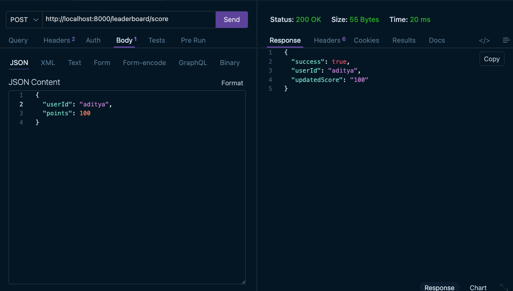
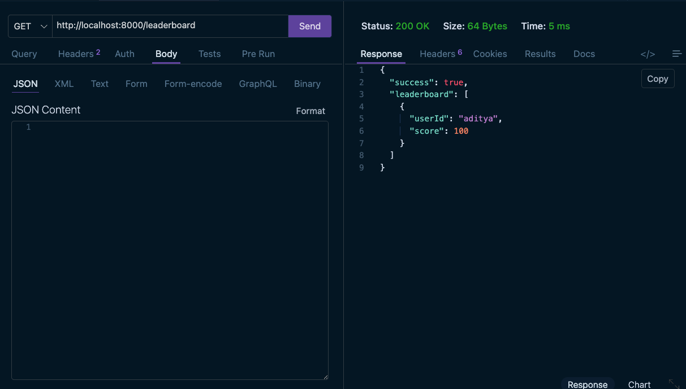
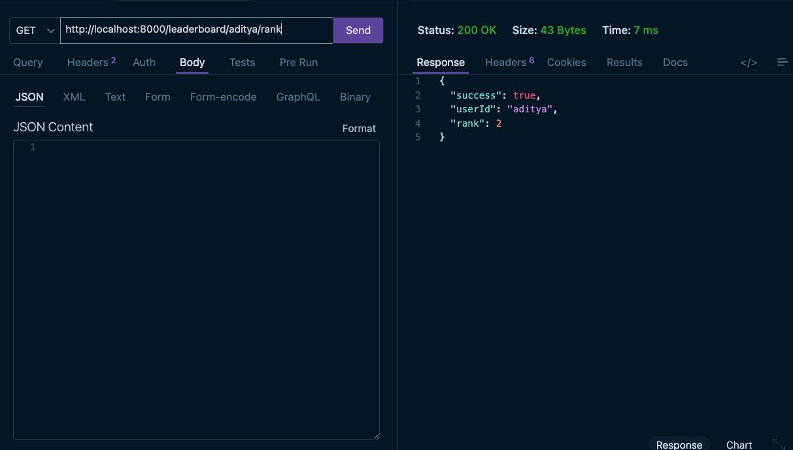

# 🚀 Redis Live Leaderboard

A simple real-time leaderboard system built to understand the true power of Redis beyond caching.

This project demonstrates how platforms like gaming systems, coding contests, fantasy sports apps, and analytics dashboards manage rankings and scores instantly — even under heavy traffic.

The goal of this project was to build a system where:

- users can gain points
- rankings update automatically
- top users can be fetched instantly
- individual ranks can be tracked in real-time
- post/article views can be counted efficiently

---

# 📌 How It Works

The application provides APIs that allow users to:

- increase scores
- update rankings
- fetch leaderboard data
- get individual user ranks
- track article views

Whenever a user gains points, the leaderboard automatically updates and reorders users based on their scores.

---

# 🏆 Add Score to Leaderboard

This endpoint allows users to gain points.

Example:
A user named `aditya` receives `100` points.

The leaderboard updates instantly.

## 📸 Request + Response

---

# 📊 Fetch Leaderboard

This endpoint returns the top users from the leaderboard.

The leaderboard automatically sorts users based on their score in descending order.

## 📸 Leaderboard Output

---

# 🎯 Get User Rank

This endpoint retrieves the exact rank of a specific user.

Instead of manually calculating rankings, Redis handles everything internally and returns the rank instantly.

## 📸 User Rank Response

---

# 👀 Post View Counter

The project also includes a simple post view counter system.

Whenever someone opens a post/article, the view count increases automatically.

This is useful for:

- blogs
- analytics dashboards
- content platforms
- social media systems

---

# 🌍 Real-World Use Cases

This type of leaderboard system is commonly used in:

- Gaming Platforms
- Fantasy Sports Apps
- Coding Contest Websites
- Live Streaming Platforms
- Analytics Dashboards
- Social Media Applications

---

# 🚀 What I Learned

While building this project, I understood:

- how real-time rankings work
- how scalable leaderboard systems are designed
- how Redis handles sorting and ranking internally
- why Redis is extremely powerful for live systems

This project was a great way to move beyond theory and actually build something used in production-level applications.

---

# ⭐ Final Thoughts

This project helped me understand how modern applications handle:

- real-time data
- live rankings
- high-speed updates
- scalable leaderboard systems

A small project, but one that teaches powerful backend engineering concepts used across the industry.
